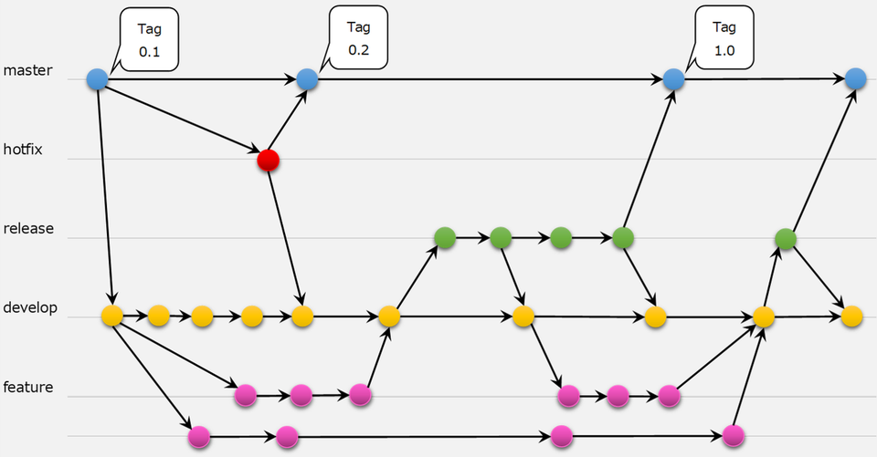

# はじめに

当リポジトリは、3-6人程度で共同開発することを想定している。  
共同開発者向けに、 "CONTRIBUTING.md" の補足資料を提供する。  

## 主なコンテンツ

- Git Flow
- プルリクエスト
- コードレビュー
- コードスタイル

# Git Flow

共同開発におけるブランチ分岐ルールのベストプラクティス。  
完全準拠する必要はないが、ある程度踏襲しつつ開発環境に応じてカスタマイズする。  
  
[git-flowを知ろう！ 利用時のルールについて - CLOUD SMITH](https://cloudsmith.co.jp/blog/efficient/2020/08/1534208.html)  

今回は以下の運用
- main  
プロダクトリリース用のブランチ。リリースしたらタグ付けする。  
プロダクトリリース（アップデート含む）の際に最新のコミットを必ず参照する。  
リリース以外では更新しない。  
- dev  
開発用ブランチ。mainから分岐し、動作確認等のリリース準備ができたらmainへマージする。  
このブランチ上で直接作業することはない。  
- feature (feat-xxxx)  
機能の追加用。devから分岐し、devにマージする。  
細かく機能毎に切り分け、一度に大量の差分をマージしないようにする。  
devにマージしたらすぐ消すのが理想。  
- hotfix  
リリース後の緊急対応（クリティカルなバグフィックスなど）用。  
mainから分岐し、mainにマージすると共にdevにマージする。  

# プルリクエスト

## 作成方法

1. [Pull request] -> [New pull request] から、baseにdev、compareにfeat-modelingを指定。
1. [Create pull request] をクリック。
1. タイトルと説明とAssignees(自分)を入力して [Create pull request] をクリック。

PRの[File changed]画面にて、コード行を指定してメッセージを追加することができる。  
レビュワーへの補足情報や、よく確認してほしい箇所などは、行指定でメッセージを書く。  
レビュワーのコスト軽減を意識する。  

## 書き方

"PULL_REQUEST_TEMPLATE.md" を参照。

# コードレビュー

## レビューからマージまでの流れ

1. [Pull request] から該当するPRを選択。
1. [Commits] または [File changed] から変更差分を確認し、必要な所にコメントを挿入する。
1. ファイル単位でコメントも可能だが、指摘があれば行単位でコメントした方が良い。
1. GitHubであれば、[+]ボタンをドラッグすれば、複数行に対してコメントができる。
1. レビューが完了したら、[Review changes] から [Comment/Approval/Request changes] を選択。
1. 承認する場合は、[Submit review] -> [Merge pull request] で完了。
1. [Delete branch] でfeatureブランチを削除する。

参考：マージ方法について  
[GithubでのWeb上からのマージの仕方3種とその使いどころ](https://qiita.com/ko-he-8/items/94e872f2154829c868df)
[【開発】スカッシュマージを卒業しプロダクトを加速させるブランチ戦略へ](https://sg.wantedly.com/companies/socialdog/post_articles/461640)

【注意点１】  
コードレビューは意図せず人格攻撃になりがちなため、トラブルが多い。  
以下を意識すると良い。  
- 修正や指摘には、必ず理由も添える。代替案や参考文献を提示するのも良いだろう。  
- 良いコードにもコメントして称賛する。指摘がなければLGTMを送ろう。  

[LooksToMe](https://looks-to.me/)  

【注意点２】  
レビューする際、喫緊で対応する必要はないが、伝えておきたいことが多々発生する。  
意図と優先度を明確にするためには、コメントにラベルを付与することが効果的。  
今回は以下のルールを採用する。下にいくほど高優先度。  

| ラベル | 意味                            | 意図                                                               |
|--------|---------------------------------|--------------------------------------------------------------------|
| Q      | 質問 (Question)                 | 質問。相手は回答が必要。                                           |
| FYI    | 参考まで (For your information) | 参考までに共有。アクションは不要。                                 |
| NITS   | あら捜し (Nitpick)              | 重箱の隅をつつく提案。無視しても良い。                             |
| IMO    | 提案 (In my opinion)            | 個人的な見解や、軽微な提案。タスク化や修正を検討。                 |
| NR     | お手すきで (No rush)            | 将来的には解決したい提案。タスク化や修正を検討。                   |
| REC    | 推奨 (Recommend)                | 早めの修整を推奨するが、必須ではない。タスク化や修正を検討。       |
| MUST   | 必須 (Must)                     | これを直さないと承認できない。致命的なバグやセキュリティ関連など。 |

[コードレビューにラベルを付けるだけでチームの心理的安全性を高めた話 - Zenn](https://zenn.dev/hacobell_dev/articles/code-review-comment-prefix)  
